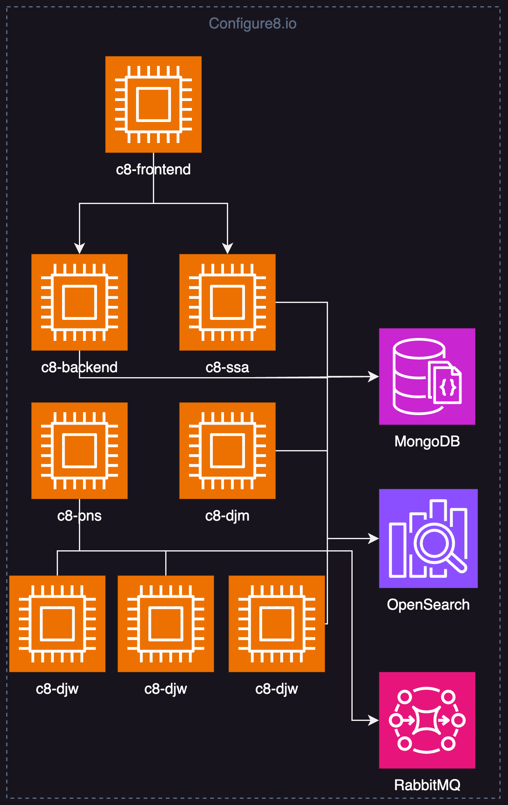

# Configure8 Self-Hosted Helm Chart Deployment Guide

This guide delineates the steps to deploy the Configure8 (C8) application on a Kubernetes cluster using a Helm chart.

<p align="center">
  
</p>

## Requirements

1. A running Kubernetes version 1.22 or above to guarantee compatibility with the C8 App. Ensure the cluster has public internet access to fetch Docker images from repositories, specifically from GitHub.
2. A Kubernetes user with sufficient cluster access privileges to install the C8 app.
3. The [Helm Package Manager](https://helm.sh/).
4. The [Kubectl](https://kubernetes.io/docs/tasks/tools/)
5. The [AWS CLI](https://docs.aws.amazon.com/cli/latest/userguide/getting-started-install.html)
6. A token provided by the C8 team for adding image pull secrets to the cluster.
7. A __MongoDB__ database must be set up, and accessible by the Kubernetes cluster.
8. A __RabbitMQ__ cluster must be set up for managing message queues within the C8 application.
9. An __OpenSearch__ cluster must be set up for robust search functionality and data analytics within the C8 app.

## Step 1: Creating a Namespace

Isolate the C8 application by creating a Kubernetes namespace named "c8":

```bash
kubectl create namespace c8
```

## Step 2: Create Docker Registry Secret

Create a Kubernetes secret to access the C8 Docker registry. Replace <Token provided to you by the C8 team> and <your email> with your specific token and email address, respectively:

```bash
kubectl create secret docker-registry c8-docker-registry-secret \
--docker-server=ghcr.io \
--docker-username=c8-user \
--docker-password=<Token provided to you by the C8 team> \
--docker-email=<your email>` \
-n c8
```

## Step 3: Create C8 Application Secret

Generate a Kubernetes secret for the C8 application, which will contain sensitive data such as API keys and database credentials. Replace 'value' with the actual values:

```bash
kubectl create secret generic c8-secret \
    --from-literal=API_KEY='value' \
    --from-literal=CRYPTO_IV='value' \
    --from-literal=CRYPTO_SECRET='value' \
    --from-literal=JWT_SECRET='value' \
    --from-literal=DB_USERNAME='value' \
    --from-literal=DB_PASSWORD='value' \
    --from-literal=RABBITMQ_USERNAME='value' \
    --from-literal=RABBITMQ_PASSWORD='value' \
    --from-literal=SMTP_USERNAME='value' \
    --from-literal=SMTP_PASSWORD='value' \
    -n c8 --dry-run=client -o yaml | kubectl apply -f -
```

### Secrets Description

| Name | Type | Default | Description |
|-----|------|---------|-------------|
| API_KEY | string | `""` | Unique secret key |
| CRYPTO_IV | string | `""` | Crypto initialization vector |
| CRYPTO_SECRET | string | `""` | Crypto password |
| DB_PASSWORD | string | `""` | Database password |
| DB_USERNAME | string | `""` | Database username |
| GITHUB_APP_CLIENT_ID | string | `""` | GitHub application client id. Should be created per installation in advance (optional) |
| GITHUB_APP_CLIENT_SECRET | string | `""` | GitHub application client secret. (optional) |
| GITHUB_APP_INSTALL_URL | string | `""` | GitHub application installation url. (optional) |
| GOOGLE_KEY | string | `""` | Google application key. Required for the sign in with google (optional) |
| GOOGLE_SECRET | string | `""` | Google application secret. Required for the login with google (optional) |
| JWT_SECRET | string | `""` | Unique secret used for sign user's JWT tokens |
| RABBITMQ_PASSWORD | string | `""` | RabbitMQ password |
| RABBITMQ_USERNAME | string | `""` | RabbitMQ user |
| SMTP_USERNAME | string | `""` | Username for SMTP server. |
| SMTP_PASSWORD | string | `""` | Password or token for SMTP authentication. |
| AWS_ACCESS_KEY_ID | string | `""` | A unique identifier associated with an AWS User. (optional, see discovery configuration) |
| AWS_SECRET_ACCESS_KEY | string | `""` | A secret string associated with the AWS_ACCESS_KEY_ID for an AWS IAM user or role. (optional, see discovery configuration) |
----------------------------------------------

> **Warning**
> You need to generate your own API_KEY, CRYPTO_IV, JWT_SECRET, and CRYPTO_SECRET which can be any cryptographically secure random string. Feel free to refer to Open Web Application Security Project (OWASP) for secure random number generation recommendations: https://cheatsheetseries.owasp.org/cheatsheets/Cryptographic_Storage_Cheat_Sheet.html#secure-random-number-generation

## Step 4: Configure AWS access for the discovery job

<details>
  <summary style="font-size: 22px;">Configure AWS access using service account (AWS EKS)</summary>

### Step 1: Create IAM Role for C8 and DJM Service Accounts

### Step 1.1: Create IAM Policy

Replace the placeholders with your specific values:

> *placeholders description*:

| Name | Description |
|-----|-------------|
| $AWS_EKS_CLUSTER_NAME | The name of the AWS EKS cluster to which we will deploy the application |
| $AWS_EKS_CLUSTER_REGION  | The AWS Region of the AWS EKS cluster to which we will deploy the application |
| $APP_NAMESPACE  | The Kubernetes namespace of the AWS EKS cluster to which we will deploy the application |

```bash
account_id=$(aws sts get-caller-identity --query "Account" --output text)
oidc_provider=$(aws eks describe-cluster --name $AWS_EKS_CLUSTER_NAME --region $AWS_EKS_CLUSTER_REGION --query "cluster.identity.oidc.issuer" --output text | sed -e "s/^https:\/\///")
namespace=$APP_NAMESPACE
service_account_c8_app=c8-backend
service_account_c8_djw=c8-djw
```

### Step 1.2: Create Trust Relationship for IAM Role

Create a trust relationship for the IAM role:

```bash
# Generate a JSON file for the trust relationship
cat >trust-relationship-sa.json <<EOF
{
  "Version": "2012-10-17",
  "Statement": [
    {
      "Effect": "Allow",
      "Principal": {
        "Federated": "arn:aws:iam::${account_id}:oidc-provider/${oidc_provider}"
      },
      "Action": "sts:AssumeRoleWithWebIdentity",
      "Condition": {
        "StringEquals": {
          "${oidc_provider}:aud": "sts.amazonaws.com",
          "${oidc_provider}:sub": [
            "system:serviceaccount:${namespace}:${service_account_c8_app}",
            "system:serviceaccount:${namespace}:${service_account_c8_djw}"
          ]
        }
      }
    }
  ]
}
EOF
```

### Step 1.3: Create IAM Role

```bash
# Create an IAM role with a defined trust relationship and description
aws iam create-role --role-name sh-c8-service-account --assume-role-policy-document file://trust-relationship-sa.json --description "The role for the Configure8 pods service account"
```

### Step 2: Create IAM Role to Assume by C8 and DJM Service Accounts

### Step 2.1: Download IAM Policy

Download the IAM policy that grants read permissions to all AWS resources:

```bash
curl -o sh-c8-discovery-policy.json https://configure8-resources.s3.us-east-2.amazonaws.com/iam/sh-c8-discovery-policy.json
```

### Step 2.2: Create IAM Policy

Create the IAM policy:

```bash
aws iam create-policy --policy-name sh-c8-discovery-policy --policy-document file://sh-c8-discovery-policy.json
```

### Step 2.3: Create IAM Role

Create an IAM role that can be assumed by the C8 and DJM service accounts:

```bash
# Generate a JSON file for the trust relationship
cat >trust-relationship.json <<EOF
{
    "Version": "2012-10-17",
    "Statement": [
        {
            "Effect": "Allow",
            "Principal": {
                "AWS": "arn:aws:iam::${account_id}:role/sh-c8-service-account"
            },
            "Action": "sts:AssumeRole"
        }
    ]
}
EOF
```

### Create an IAM role with a defined trust relationship and description

```bash
aws iam create-role --role-name sh-c8-discovery --assume-role-policy-document file://trust-relationship.json --description "sh-c8-discovery"
```

### Attach the sh-c8-discovery to the policy

```bash
aws iam attach-role-policy --role-name sh-c8-discovery --policy-arn=arn:aws:iam::$account_id:policy/sh-c8-discovery-policy
```

> **Note**
> If you want to discover more AWS accounts, please repeat the 2nd step for each account.

</details>

<details>
  <summary style="font-size: 22px;">Configure AWS access using IAM role for EC2</summary>

### Step 1: Create IAM Role for EC2

[Please refer to the official AWS documentation about creating an AWS IAM role for the EC2](https://docs.aws.amazon.com/AWSEC2/latest/UserGuide/iam-roles-for-amazon-ec2.html#create-iam-role)

## Step 2: Create IAM Role to assume by EC2 instance role.

### Step 2.1: Download IAM Policy

Download the IAM policy that grants read permissions to all AWS resources:

```bash
curl -o sh-c8-discovery-policy.json https://configure8-resources.s3.us-east-2.amazonaws.com/iam/sh-c8-discovery-policy.json
```

### Step 2.2: Create IAM Policy

Create the IAM policy:

```bash
aws iam create-policy --policy-name sh-c8-discovery-policy --policy-document file://sh-c8-discovery-policy.json
```

### Step 2.3: Create IAM Role

Create an IAM role that can be assumed by EC2 roles:

| Name | Description |
|-----|-------------|
| $account_id | The AWS account id from which you want to allow run discovery |
| $ec2_role  | The AWS role name from which you want to allow run discovery |

```bash
# Generate a JSON file for the trust relationship
cat >trust-relationship.json <<EOF
{
    "Version": "2012-10-17",
    "Statement": [
        {
            "Effect": "Allow",
            "Principal": {
                "AWS": "arn:aws:iam::${account_id}:role/${ec2_role}"
            },
            "Action": "sts:AssumeRole"
        }
    ]
}
EOF
```

### Create an IAM role with a defined trust relationship and description

```bash
aws iam create-role --role-name sh-c8-discovery --assume-role-policy-document file://trust-relationship.json --description "sh-c8-discovery"
```

### Attach the sh-c8-discovery to the policy

```bash
aws iam attach-role-policy --role-name sh-c8-discovery --policy-arn=arn:aws:iam::${account_id}:policy/sh-c8-discovery-policy
```

> **Note**
> If you want to discover more AWS accounts, please repeat the 2nd step for each account.

</details>

<details>
  <summary style="font-size: 22px;">Configure AWS access using access keys for IAM users</summary>

### Step 1: Create IAM User

[Please refer to the official AWS documentation about creating access keys for IAM users](https://docs.aws.amazon.com/IAM/latest/UserGuide/id_credentials_access-keys.html)

> **Important**
> As a [best practice](https://docs.aws.amazon.com/IAM/latest/UserGuide/best-practices.html), use temporary security credentials (such as IAM roles) instead of creating long-term credentials like access keys.

### Step 2: Create IAM Role to assume by EC2 instance role.

### Step 2.1: Download IAM Policy

Download the IAM policy that grants read permissions to all AWS resources:

```bash
curl -o sh-c8-discovery-policy.json https://configure8-resources.s3.us-east-2.amazonaws.com/iam/sh-c8-discovery-policy.json
```

### Step 2.2: Create IAM Policy

Create the IAM policy:

```bash
aws iam create-policy --policy-name sh-c8-discovery-policy --policy-document file://sh-c8-discovery-policy.json
```

### Step 2.3: Create IAM Role

Create an IAM role that can be assumed by EC2 roles:

| Name | Description |
|-----|-------------|
| $account_id | The AWS account id from which you want to allow run discovery |
| $iam_user  | The AWS IAM user name from which you want to allow run discovery |

```bash
# Generate a JSON file for the trust relationship
cat >trust-relationship.json <<EOF
{
    "Version": "2012-10-17",
    "Statement": [
        {
            "Effect": "Allow",
            "Principal": {
                "AWS": "arn:aws:iam::${account_id}:user/${iam_user}"
            },
            "Action": "sts:AssumeRole"
        }
    ]
}
EOF
```

### Create an IAM role with a defined trust relationship and description

```bash
aws iam create-role --role-name sh-c8-discovery --assume-role-policy-document file://trust-relationship.json --description "sh-c8-discovery"
```

### Attach the sh-c8-discovery to the policy

```bash
aws iam attach-role-policy --role-name sh-c8-discovery --policy-arn=arn:aws:iam::${account_id}:policy/sh-c8-discovery-policy
```

> **Note**
> If you want to discover more AWS accounts, please repeat the 2nd step for each account.

> **Important**
> Don't forget to add the AWS_ACCESS_KEY_ID and AWS_SECRET_ACCESS_KEY variables to the c8-secret secret on the 3rd step.

</details>

## Step 5: Install the C8 Helm Chart

### Step 5.1: Add Configure8 Chart Repository

Add the [Configure8](https://app.configure8.io) chart repository and update it:

```bash
helm repo add c8 https://helm.configure8.io/store/
helm repo update
```

### Step 5.2: Install the Helm Chart

Install the Helm chart with the desired configurations. Replace the placeholders with your specific values:

```bash
helm upgrade -i sh-c8 ./helm-charts/c8 \
    -n c8 \
    --set variables.AWS_REGION='value' \
    --set variables.DB_HOST='value' \
    --set variables.DB_DATABASE='value' \
    --set variables.DEEPLINK_URL='value' \
    --set variables.HOOKS_CALLBACK_URL='value' \
    --set variables.OPENSEARCH_NODE='value' \
    --set variables.RABBITMQ_HOST='value' \
    --set common.ingress.ingressClassName='value' \
    --set djm.serviceAccount.job_worker.annotations."eks\.amazonaws\.com/role-arn"='The IAM role was created above for the service account' \
    --set backend.serviceAccount.annotations."eks\.amazonaws\.com/role-arn"='The IAM role was created above for the service account'

```

> **Warning**
> You don't need to set djm.serviceAccount.job_worker.annotations."eks.amazonaws.com/role-arn" and backend.serviceAccount.annotations."eks.amazonaws.com/role-arn" if you use access type EC2 role or AWS access user keys.

Once you successfully install a Helm chart that includes Ingress configurations, the next vital step is to establish a CNAME record in your DNS settings. This is essential to map your domain name to the Ingress controller's service endpoint.

Ensuring that the DNS propagates the new record correctly and securely linking it via TLS/SSL certificates (if applicable) will bolster both usability and security for end-users navigating to your c8 applications.

### Application Variables

The table below lists the key application variables that can be configured during deployment:

| Key | Type | Default | Description |
|-----|------|---------|-------------|
| variables.AWS_REGION | string | `"us-east-1"` | The region what actually we use with AWS integration |
| variables.DB_AUTH_MECHANISM | string | `"SCRAM-SHA-1"` | The mechanism of how to authenticate with the database. Might be SCRAM-SHA-1 or any other supported by mongodb |
| variables.DB_DATABASE | string | `"c8"` | Database name |
| variables.DB_HOST | string | `""` | Database host |
| variables.DB_PORT | string | `"27017"` | Database port |
| variables.DEEPLINK_URL | string | `""` | Url on which the application will be available. For example https://configure8.my-company.io |
| variables.DEFAULT_SENDER | string | `"notifications@example.com"` | Default email for sending notifications. |
| variables.HOOKS_CALLBACK_URL | string | `""` | Url on which the application will be available. Usually should be the same as DEEPLINK_URLFor example https://configure8.my-company.io |
| variables.MONGO_DRIVER_TYPE | string | `"mongoDb"` | Type of the driver. For atlas mongoDbAtlas and mongoDb for the regular instance |
| variables.OPENSEARCH_NODE | string | `""` | ElasticSearch url |
| variables.RABBITMQ_HOST | string | `""` | RabbitMQ host |
| variables.RABBITMQ_PORT | int | `5672` | RabbitMQ port |
| variables.SEGMENT_KEY | string | `"na"` | Application analytics segment key |
| variables.USE_SMTP_STRATEGY | string | `"true"` | Flag to use SMTP for emails |
| variables.SMTP_HOST | string | `"smtp.sendgrid.net"` | Address of the SMTP server (e.g., SendGrid's server). |
| variables.SMTP_PORT | string | `"587"` | Port for connecting to the SMTP server |
| variables.SSA_SWAGGER_ENABLED | string | `"false"` | Enable or disable swagger documentation |
| variables.SWAGGER_ENABLED | string | `"false"` | Enable or disable swagger documentation |
| variables.TZ | string | `"America/New_York"` | Application timezone |

### The C8 Helm Chart Parameters

The table below shows configurable parameters when deploying the C8 Helm chart:

| Key | Type | Default | Description |
|-----|------|---------|-------------|
| backend.affinity | object | `{}` | Affinity for pod assignment https://kubernetes.io/docs/concepts/configuration/assign-pod-node/#affinity-and-anti-affinity |
| backend.autoscaling.enabled | bool | `false` |  |
| backend.autoscaling.maxReplicas | int | `10` |  |
| backend.autoscaling.minReplicas | int | `1` |  |
| backend.autoscaling.targetCPUUtilizationPercentage | int | `80` |  |
| backend.autoscaling.targetMemoryUtilizationPercentage | int | `80` |  |
| backend.enabled | bool | `true` |  |
| backend.image.pullPolicy | string | `"IfNotPresent"` |  |
| backend.image.repository | string | `"ghcr.io/configure8inc/c8-backend"` |  |
| backend.image.tag | string | `"1.0.0"` |  |
| backend.livenessProbe.failureThreshold | int | `3` |  |
| backend.livenessProbe.httpGet.path | string | `"/api/v1/ping"` |  |
| backend.livenessProbe.httpGet.port | int | `5000` |  |
| backend.livenessProbe.periodSeconds | int | `10` |  |
| backend.livenessProbe.timeoutSeconds | int | `10` |  |
| backend.nodeSelector | object | `{}` | Node labels for pod assignment https://kubernetes.io/docs/user-guide/node-selection/ |
| backend.podAnnotations | object | `{}` |  |
| backend.podDisruptionBudget.enabled | bool | `false` | Specifies whether pod disruption budget should be created |
| backend.podDisruptionBudget.minAvailable | string | `"50%"` | Number or percentage of pods that must be available |
| backend.podSecurityContext | object | `{}` |  |
| backend.readinessProbe.failureThreshold | int | `3` |  |
| backend.readinessProbe.httpGet.path | string | `"/api/v1/ping"` |  |
| backend.readinessProbe.httpGet.port | int | `5000` |  |
| backend.readinessProbe.periodSeconds | int | `10` |  |
| backend.readinessProbe.timeoutSeconds | int | `10` |  |
| backend.replicaCount | int | `1` |  |
| backend.resources | object | `{}` | Define resources requests and limits for Pods. https://kubernetes.io/docs/user-guide/compute-resources/ |
| backend.securityContext | object | `{}` |  |
| backend.service | object | `{"port":"5000","type":"ClusterIP"}` | Configuration for backend service |
| backend.serviceAccount.annotations | object | `{}` | Annotations to add to the service account |
| backend.serviceAccount.create | bool | `true` | Specifies whether a service account should be created |
| backend.serviceAccount.name | string | `""` | The name of the service account to use. If not set and create is true, a name is generated using the fullname template |
| backend.startupProbe.failureThreshold | int | `5` |  |
| backend.startupProbe.httpGet.path | string | `"/api/v1/ping"` |  |
| backend.startupProbe.httpGet.port | int | `5000` |  |
| backend.startupProbe.initialDelaySeconds | int | `20` |  |
| backend.startupProbe.periodSeconds | int | `10` |  |
| backend.startupProbe.timeoutSeconds | int | `10` |  |
| backend.tolerations | list | `[]` | Tolerations for pod assignment https://kubernetes.io/docs/concepts/configuration/taint-and-toleration/ |
| common.C8_SECRET_NAME | string | `"c8-secret"` |  |
| common.IMAGE_PULL_SECRET | string | `"c8-docker-registry-secret"` | image pull secrets |
| common.ingress.annotations | object | `{}` |  |
| common.ingress.enabled | bool | `true` | Enable ingress object for external access to the resources . Do not forget to add common.ingress.ingressClassName="" |
| common.ingress.ingressClassName | string | `""` |  |
| common.ingress.labels | object | `{}` |  |
| common.ingress.pathType | string | `"Prefix"` |  |
| commonLabels | object | `{}` | Labels to apply to all resources |
| djm.DJW_IMAGE | string | `"ghcr.io/configure8inc/c8-djw:1.0.0"` | Discovery job worker image |
| djm.DJW_NODE_SELECTOR_KEY | string | `""` | Discovery job worker NodeSelector key |
| djm.DJW_NODE_SELECTOR_VALUE | string | `""` | Discovery job worker NodeSelector value |
| djm.DJW_POD_SECURITY_CONTEXT | string | `'{"runAsUser": 1052, "runAsGroup": 1052, "runAsNonRoot": true}'` | Discovery job worker pod security context |
| djm.affinity | object | `{}` | Affinity for pod assignment https://kubernetes.io/docs/concepts/configuration/assign-pod-node/#affinity-and-anti-affinity |
| djm.container.port | string | `"5000"` |  |
| djm.enabled | bool | `true` |  |
| djm.image.pullPolicy | string | `"IfNotPresent"` |  |
| djm.image.repository | string | `"ghcr.io/configure8inc/c8-djm"` | c8 docker image repository |
| djm.image.tag | string | `"1.0.0"` |  |
| djm.nodeSelector | object | `{}` | Node labels for pod assignment https://kubernetes.io/docs/user-guide/node-selection/ |
| djm.podAnnotations | object | `{}` |  |
| djm.podSecurityContext | object | `{}` |  |
| djm.replicaCount | int | `1` |  |
| djm.resources | object | `{}` | Define resources requests and limits for Pods. https://kubernetes.io/docs/user-guide/compute-resources/ |
| djm.securityContext | object | `{}` |  |
| djm.serviceAccount.annotations | object | `{}` | Annotations to add to the service account |
| djm.serviceAccount.create | bool | `true` | Specifies whether a service account should be created |
| djm.serviceAccount.job_worker.annotations | object | `{}` | Annotations to add to the service account |
| djm.serviceAccount.job_worker.name | string | `nil` | The name of the djw service account to use. If not set and create is true, a name is generated using the fullname template |
| djm.serviceAccount.name | string | `""` | The name of the service account to use. If not set and create is true, a name is generated using the fullname template |
| djm.tolerations | list | `[]` | Tolerations for pod assignment https://kubernetes.io/docs/concepts/configuration/taint-and-toleration/ |
| frontend.affinity | object | `{}` | Affinity for pod assignment https://kubernetes.io/docs/concepts/configuration/assign-pod-node/#affinity-and-anti-affinity |
| frontend.autoscaling.enabled | bool | `false` |  |
| frontend.autoscaling.maxReplicas | int | `10` |  |
| frontend.autoscaling.minReplicas | int | `1` |  |
| frontend.autoscaling.targetCPUUtilizationPercentage | int | `80` |  |
| frontend.autoscaling.targetMemoryUtilizationPercentage | int | `80` |  |
| frontend.enabled | bool | `true` |  |
| frontend.image.pullPolicy | string | `"IfNotPresent"` |  |
| frontend.image.repository | string | `"ghcr.io/configure8inc/c8-frontend"` |  |
| frontend.image.tag | string | `"1.0.0"` |  |
| frontend.livenessProbe.failureThreshold | int | `2` |  |
| frontend.livenessProbe.httpGet.path | string | `"/"` |  |
| frontend.livenessProbe.httpGet.port | string | `"http"` |  |
| frontend.livenessProbe.periodSeconds | int | `10` |  |
| frontend.nodeSelector | object | `{}` | Node labels for pod assignment https://kubernetes.io/docs/user-guide/node-selection/ |
| frontend.podAnnotations | object | `{}` |  |
| frontend.podDisruptionBudget.enabled | bool | `false` |  |
| frontend.podDisruptionBudget.minAvailable | string | `"50%"` |  |
| frontend.podSecurityContext | object | `{}` |  |
| frontend.readinessProbe.failureThreshold | int | `2` |  |
| frontend.readinessProbe.httpGet.path | string | `"/"` |  |
| frontend.readinessProbe.httpGet.port | string | `"http"` |  |
| frontend.readinessProbe.initialDelaySeconds | int | `20` |  |
| frontend.readinessProbe.periodSeconds | int | `10` |  |
| frontend.replicaCount | int | `1` |  |
| frontend.resources | object | `{}` | Define resources requests and limits for Pods. https://kubernetes.io/docs/user-guide/compute-resources/ |
| frontend.securityContext | object | `{}` |  |
| frontend.service | object | `{"port":"80","type":"ClusterIP"}` | Configuration for frontend service |
| frontend.serviceAccount.annotations | object | `{}` |  |
| frontend.serviceAccount.create | bool | `false` |  |
| frontend.serviceAccount.name | string | `""` |  |
| frontend.tolerations | list | `[]` | Tolerations for pod assignment https://kubernetes.io/docs/concepts/configuration/taint-and-toleration/ |
| fullnameOverride | string | `""` | Provide a name to substitute for the full names of resources |
| migration.affinity | object | `{}` | Affinity for pod assignment https://kubernetes.io/docs/concepts/configuration/assign-pod-node/#affinity-and-anti-affinity |
| migration.image.pullPolicy | string | `"IfNotPresent"` |  |
| migration.image.repository | string | `"ghcr.io/configure8inc/c8-migrations"` |  |
| migration.image.tag | string | `"1.0.0"` |  |
| migration.nodeSelector | object | `{}` | Node labels for pod assignment https://kubernetes.io/docs/user-guide/node-selection/ |
| migration.serviceAccount.annotations | object | `{}` |  |
| migration.serviceAccount.create | bool | `false` |  |
| migration.serviceAccount.name | string | `""` |  |
| migration.tolerations | list | `[]` | Tolerations for pod assignment https://kubernetes.io/docs/concepts/configuration/taint-and-toleration/ |
| nameOverride | string | `""` | Provide a name in place of c8 for `app:` labels |
| pns.affinity | object | `{}` | Affinity for pod assignment https://kubernetes.io/docs/concepts/configuration/assign-pod-node/#affinity-and-anti-affinity |
| pns.autoscaling.enabled | bool | `false` |  |
| pns.autoscaling.maxReplicas | int | `10` |  |
| pns.autoscaling.minReplicas | int | `1` |  |
| pns.autoscaling.targetCPUUtilizationPercentage | int | `80` |  |
| pns.autoscaling.targetMemoryUtilizationPercentage | int | `80` |  |
| pns.container.port | string | `"5000"` |  |
| pns.enabled | bool | `true` |  |
| pns.image.pullPolicy | string | `"IfNotPresent"` |  |
| pns.image.repository | string | `"ghcr.io/configure8inc/c8-pns"` |  |
| pns.image.tag | string | `"1.0.0"` |  |
| pns.nodeSelector | object | `{}` | Node labels for pod assignment https://kubernetes.io/docs/user-guide/node-selection/ |
| pns.podAnnotations | object | `{}` |  |
| pns.podDisruptionBudget.enabled | bool | `false` |  |
| pns.podDisruptionBudget.minAvailable | string | `"50%"` |  |
| pns.podSecurityContext | object | `{}` |  |
| pns.replicaCount | int | `1` |  |
| pns.resources | object | `{}` | Define resources requests and limits for Pods. https://kubernetes.io/docs/user-guide/compute-resources/ |
| pns.securityContext | object | `{}` |  |
| pns.service | object | `{"enabled":true,"port":"5000","type":"ClusterIP"}` | Configuration for pns service |
| pns.serviceAccount.annotations | object | `{}` | Annotations to add to the service account |
| pns.serviceAccount.create | bool | `true` | Specifies whether a service account should be created |
| pns.serviceAccount.name | string | `""` | The name of the service account to use. If not set and create is true, a name is generated using the fullname template |
| pns.tolerations | list | `[]` | Tolerations for pod assignment https://kubernetes.io/docs/concepts/configuration/taint-and-toleration/ |
| ssa.affinity | object | `{}` | Affinity for pod assignment https://kubernetes.io/docs/concepts/configuration/assign-pod-node/#affinity-and-anti-affinity |
| ssa.container.port | string | `"5000"` |  |
| ssa.enabled | bool | `true` |  |
| ssa.image.pullPolicy | string | `"IfNotPresent"` |  |
| ssa.image.repository | string | `"ghcr.io/configure8inc/c8-ssa"` |  |
| ssa.image.tag | string | `"1.0.0"` |  |
| ssa.ingress.annotations | object | `{}` |  |
| ssa.ingress.enabled | bool | `true` |  |
| ssa.ingress.ingressClassName | string | `""` |  |
| ssa.ingress.labels | object | `{}` |  |
| ssa.ingress.pathType | string | `"Prefix"` |  |
| ssa.livenessProbe.failureThreshold | int | `3` |  |
| ssa.livenessProbe.httpGet.path | string | `"/self-service/api/health"` |  |
| ssa.livenessProbe.httpGet.port | int | `5000` |  |
| ssa.livenessProbe.httpGet.scheme | string | `"HTTP"` |  |
| ssa.livenessProbe.periodSeconds | int | `10` |  |
| ssa.livenessProbe.timeoutSeconds | int | `10` |  |
| ssa.nodeSelector | object | `{}` | Node labels for pod assignment https://kubernetes.io/docs/user-guide/node-selection/ |
| ssa.podAnnotations | object | `{}` |  |
| ssa.podDisruptionBudget.enabled | bool | `false` | Specifies whether pod disruption budget should be created |
| ssa.podDisruptionBudget.minAvailable | string | `"50%"` | Number or percentage of pods that must be available |
| ssa.podSecurityContext | object | `{}` |  |
| ssa.readinessProbe.failureThreshold | int | `3` |  |
| ssa.readinessProbe.httpGet.path | string | `"/self-service/api/health"` |  |
| ssa.readinessProbe.httpGet.port | int | `5000` |  |
| ssa.readinessProbe.httpGet.scheme | string | `"HTTP"` |  |
| ssa.readinessProbe.periodSeconds | int | `10` |  |
| ssa.readinessProbe.timeoutSeconds | int | `10` |  |
| ssa.replicaCount | int | `1` |  |
| ssa.resources | object | `{}` | Define resources requests and limits for Pods. https://kubernetes.io/docs/user-guide/compute-resources/ |
| ssa.securityContext | object | `{}` |  |
| ssa.service | object | `{"enabled":true,"port":"5000","type":"ClusterIP"}` | Configuration for ssa service |
| ssa.serviceAccount.annotations | object | `{}` | Annotations to add to the service account |
| ssa.serviceAccount.create | bool | `true` | Specifies whether a service account should be created |
| ssa.serviceAccount.name | string | `""` | The name of the service account to use. If not set and create is true, a name is generated using the fullname template |
| ssa.tolerations | list | `[]` | Tolerations for pod assignment https://kubernetes.io/docs/concepts/configuration/taint-and-toleration/ |

----------------------------------------------
